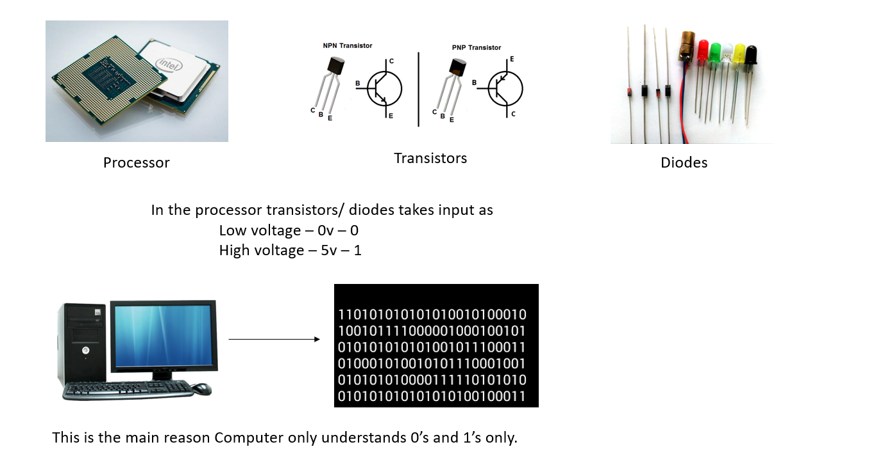
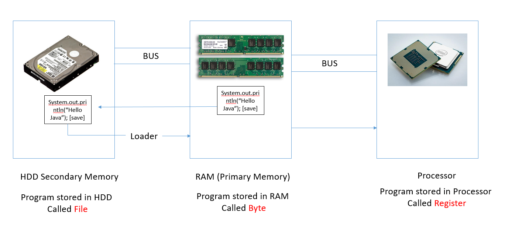

# Computer Programming Fundamental
### Agenda
- How the CPU/Processor works in the Computer ?
- How the C program executes ?

#### Here I am trying to summarize the concepts by asking questions

### 1. What is processor/CPU ?
  - Processor is a semiconducting device which is responsible for provides the instructions and processing power to the computer to work.

### 2. why computer understand binary code only ?
  - A processor made up of semiconductind devices which contians dioads and transistors.
  - Dioads and transistors (PNP & NPN) which take only 2 inputs
      - Low voltage : 0v
      - High voltage : 5v 
  - In computer terminalogy it will be represented as a binary format 
      - Low voltage : 0 
      - High voltage : 1 
  - So the processor in computer only understand 0's and 1's, Finally this is the main reason behind Computers only understand binary code (0's and 1's) this is called  " machine level language (MLL) ".
  
  
  
### 3. What is program / application / Software ?
 - A set of instructions (lines of code) that is executed by the computer.

### 4. What is the importance of Assembly Language (AL) and High Level Language (HLL) ? 
- Computer only understad Machine Level Language (MLL) but its deficult to write the programes in 0's and 1's so first people using the nemonics to write the code and these nemonics later converted as MLL by Assembler this is called Assembly Language (AL).
- Writting nemonics also little difficult so then people using the english like language and symbols to write the instructions this is called High level language by using the compiler later it converted to MLL to executed by the processor.

  

### What is the imporatance and drawback of RAM (Random Access Memory) ? 
- What ever the programme we write initially stroed in the HDD (Hard Disk Drive) it is a magnetic technology, HDD connect with the processor using BUS.
- The instruction loaded from HDD to processor, but there is a efficiency issues. Because by default processor work fast it need to be waited for HDD instruction due different technologies usage overall efficiency and run time goes down.
- This is where RAM comes into picture it is semiconducting device runs very fast as processor but the issue is this is volatile memory with a limted space.
- Volatile Memory:
    - It is not perminantly storage temporary store when erver power off entire data goes off (RAM) also called Primary Memory.
- Non Volatile Memory:
    - Once save in never delete perminant storage (HDD) also called Secondary Memory.
- Now the issue taken care by Connect the HDD to RAM that connects to Processor.
- What ever the programs we write in the RAM when ever we save its goes into HDD by using the Loading again comes to RAM then Processor.
- Now a day people using SSD (Solid State Device) semiconducting technology insted of HDD way faseter than HDD.
- Analogy:
    - Type the number in phone not save if phone switch off number gone (RAM)
    - Type the number and save if phone switch off number never gone (HDD)

 
 
### What  is Cache Memory ?
- If we execute a program in many times the processe stored this application details in cache memory when ever agian we want access it is not take from the RAM its directly taken from the cache memory it self.
- Its execution is really fast
- The browser maintain the cache memory for fast rendering the frequent applications.

### What is Object File and Executable file ?
- Object file : It is a incomplete file (only the code you written with out library bodies) code in a MLL
- Executable file : It is a complete file (contains you code + libaraties body you are using) code in a MLL 

### How the C Program Execute ?
1. The code you written in the ram when ever you saved it goes to HDD
2. By using compiler the HLL translate into MLL but it is incomplete file called Object file
3. Then by using the Linker it combines the Object file code + libraries body code and make a complete fiel called Executable file(.exe)
4. That exe file by using loader goes to RAM and then goes to Processor and execute

 
 
 
 
 
 
 
 
 
 
