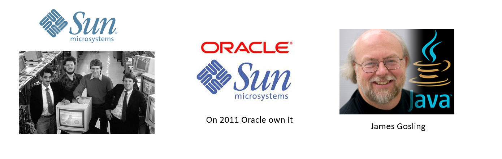
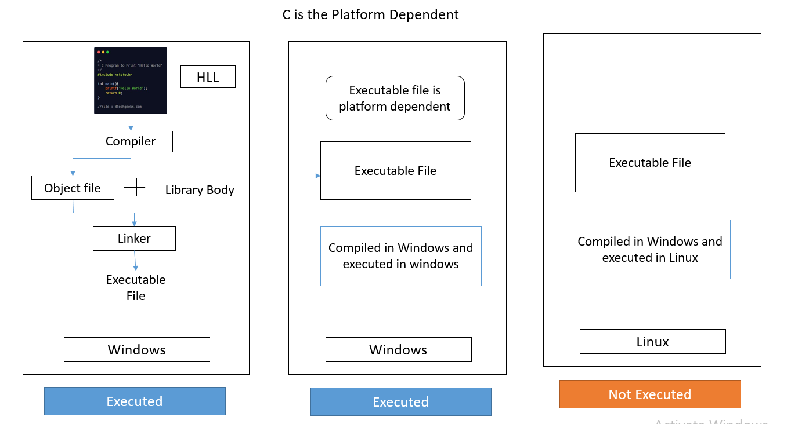
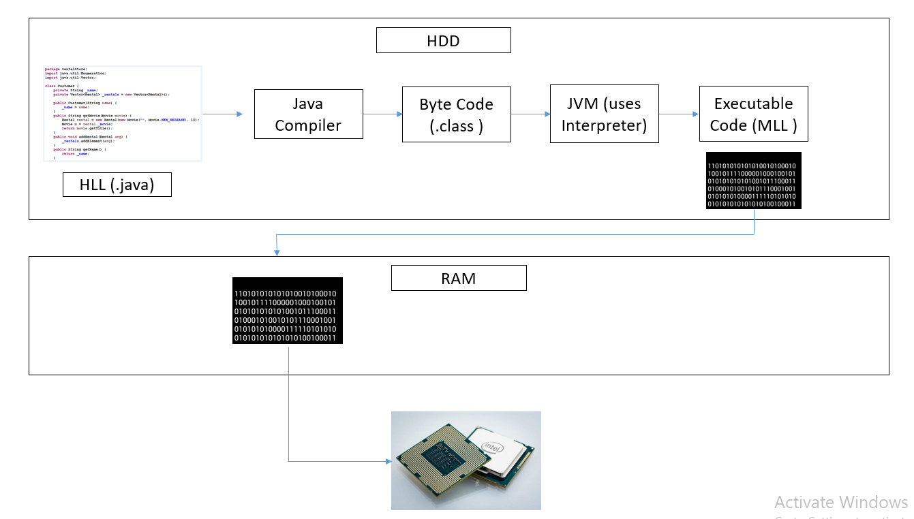
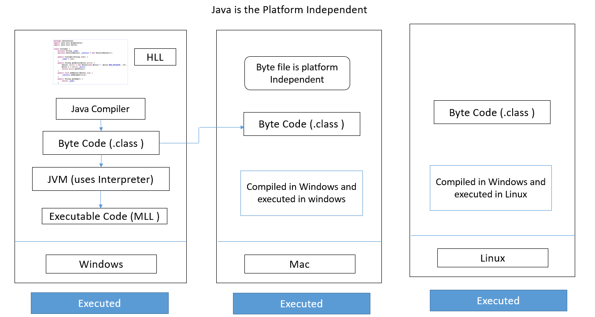
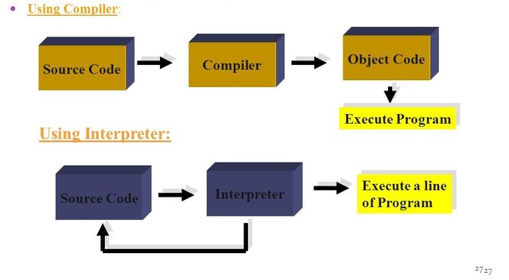
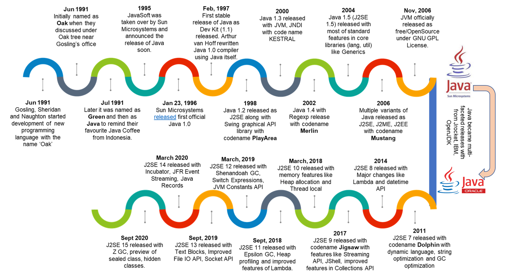

## How Java Code Executed and Different versions of Java

### What is Java ?
- Java is class based Statically typed platform independent/protable/ORA/WORA Object Oriented Programming language.
- Java is developed at sun microsystem in USA in the year of 1991 with a 11 member team headed by James Gosling.
- First trail version Java alpha, beta release at 1995
- First official version of Java relaase at 1996 January
- Oracle own the sun micro systems at the year of 2011

 

### Why it is called Java ?
- Intial development of Java people tried for different name like oka, green, c++++, c++--, and with the developer names all are getting failed
- They getting demotivated, generally whenever they get demotivated they used to swip a cup of coffe that will refresh them
- So, finally they decided that Give the coffee name they used to drink it is from Indonesia that plant called Java.
- That was the reason the symbol for java also in the coffe cup.

### How C language is platform dependent ?
- C programe (HLL) -> Compiler -> object file -> linker (obj + library file) -> executable file(.exe) (platform dependent)
- The executable file is plaform dependent i.e bothe the compile code and executable code should be run in the same platfor
- Platform : Is genarally called the Operating System + Processor. In Software industry platform treated as OS
- Example:
    - CASE1: platform (windows) - compile (windows) - execution (windows)  - Run Successful
    - CASE2: platform (windows) - executable (windows)   - Run successful 
        - Here take the direct .exe file from the system1
    - CASE3: platform (linux) - executable(windows) - It Fails
        - Here compile code at windows but try to execution in Linux it fail 
    - This is called the platform dependency
 
 

### How the Java language is platform independent ? 
- Java prog(HLL) (souce file) -> Java Compiler -> Byte code (class file) (Neither HLL nor MLL) (platform independent) -> JVM (Internally use interpreter) -> executable code 
- So the byte code is platform independent we share the byte code (class files) over internet it can executed in any platform
- WORA : Write Once Run Antwhere
- Note the JDK (JVM) is different for different platforms.

### What is the difference between interpreter and compliler and where Java fits ?
- Compiler: Basically it is used to translate HLL to MLL here compiler translate entire code at once.
       - i.e If the code has 100 lines it translate all at once
       - If any error at any of the line entire code get fails
       - Ex: C, C++ 
- Interpreter: It is also translate HLL to MLL but it is executed the code line by line.
        - i.e The code has 100 line, if 80th line fails before 79 lines code executed
        - Ex: python
- Analogy: If the speech going on the speake talks in chines
        - Case1 : entire 1 hour speech translate in english -> Compiler
        - Case2 : translate the line by line speech into english -> Interpreter
- Java : In case of Java it is a Hybride programming language, it uses both Compliation and Interpretation
        - Source code --> Java Compilation --> Bite Code (Compilation)
        - Bite Code --> JVM (uses Interpreter) --> Executable code (MLL) 

### Different Version of Java ?

- Java Project started at - 1991 (Sun micro systems)
- Java trail versions  -> 1995
- Java 1.0 -> 1996 Jan
- Java 1.2 -> 1998
    - Collection Framework
    - Swing (GUI Graphical User Interface) Desktop App
    - JIT Compiler
- J2SE 1.3 -> 2000
- J2SE 1.4 -> 2002
- J2SE 5.0 -> 2004
    - Annotations
    - Auto boxing
    - Enumarations
    - Enhanced For loops
- Java SE6 -> 2006
- Java SE7 -> 2011  (Oracle Approache and taken sun microsystems)
    - Strings in switch
    - try with resources
    - <> diamond operation
- Java SE8 -> 2014
    - lambda functions
    - support for JS code
    - date and time API
    - stream API
- Java 9 -> 2017  (Make java for Paid)
    - Modularity
    - relative streams
    - J shell
- Java 10 -> 2018
    - Local variable tye interfaces
- Java 11 
    - run Source code
    - var for Lambda
- Java 12
- Java 13
    - switch experssion
    - Multiline strings 
- Java 14
    - records
    - packing tools
- Java 15
- Java 16
- Java 17
    - sealed classes
- Java 18
- Java 19 (Current version for 2022 OCT)
    - Virtual threads
    - Vector API 
- Java 20 (Release on 2023 March)

- Every 6 months they releases the new version of Java

- LTS (Long Term Support version)
    - Java 8 (80% industry projects on this)
    - Java 11 (8 to 10%)
    - Java 17 (latest stable version)
- In this course mostly use Java 11
