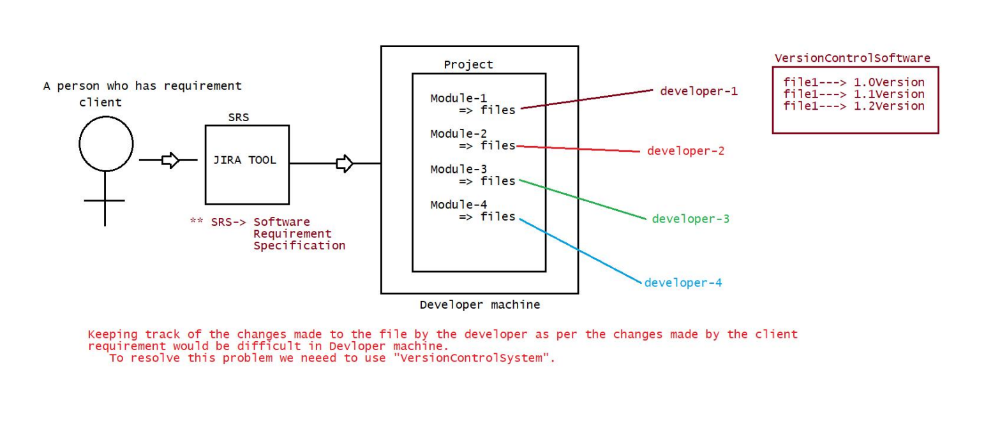
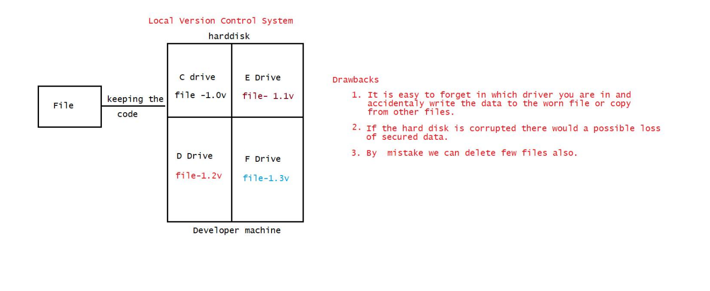
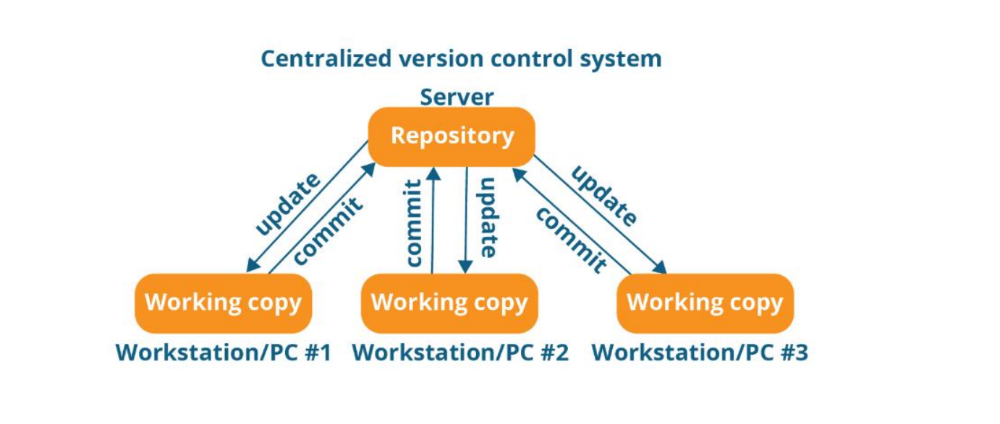
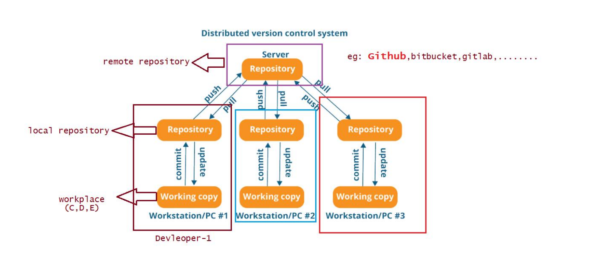
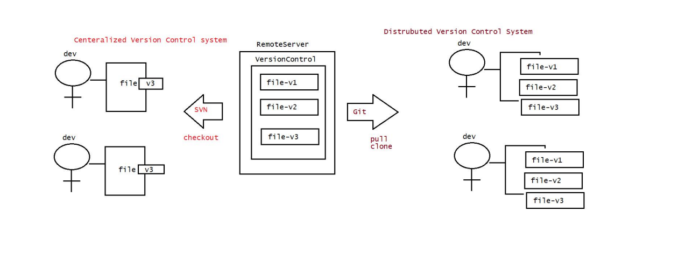
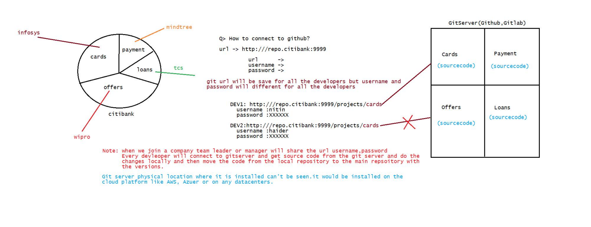
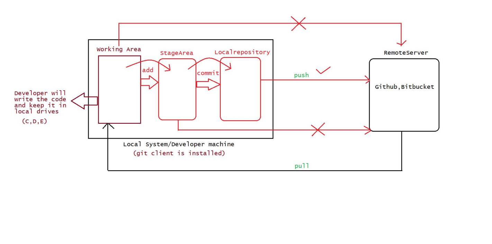

## Version Control Systems (Git) & GitHub

### Git Topics 
- Introduction
- What is VersionControl System(VCS) and types of VCS
    -  Local Version Control System
    -  Centralized Version Control System
    -  Disturbuted Version Control System(github,bitbucket,...)
- Git Software installation
- Git project Architecture
- Git commands or Operations
    - git help
    - git init
    - git config
    - git add 
    - git status
    - git rm
    - git restore
    - git commit
    - git log
    - git clone
    - git push
    - git pull
    - git branch
    - git checkout
    - git fetch
    - git stash
    - git merge
    - git rebase
    - git diff
    - git revert
    - git mv
    - git show
- Git commands execution
    - using commandline(gitbash,gitcmd,gitgui)
    -  using IDE's like Eclipse/STS(SpringToolSuite)/Intelij
- Github account creation
    -  public repository creation
    -  private repository creation
- Git folder structure
-  Git Branching Strategy
    - developer branch
    - master branch
    - release branch
    - hofix branch
    - fork branch
- Project Review Process(PR process), Code Reviews,Code Merge
- Realtime problems with git and how to fix them
- FAQ's

### What is Git ?
- Git is a popular Version Control system (VCS)
- It was created by Linus Torvalds in 2005 and it is maintained by Junio Hamano
- Git used for
    - Tracking code changes
    - Tracking who made the changes like history of files
    -  Coding Collobarations

### What is Version Control System/Software(VSM) ?
- It is a system that records changes made to the file or set of files over the time,so that we can recall the specific version later.
- ie, for every source code change in a file a new version will be created
    - eg: JDK1.0V, JDK1.1V, JDK1.2V,........
    - Spring1.X,Spring2.X,Spring3.X,......
 

- Types of Version Control Software(VCS)
    -  Local Version Control System
    -  Centralized Version Control System
    -  Disturbuted Version Control System

### What is Local Version Control System ? 
- It is used to maintain the file version and retreive the files based on the specific version in local (Individual machines)

- Drawbacks:
    - It is easy to forget in which drive you are in and accidentally write the data to the worng file or copy from other files.
    - If the hard disk is corrupted there would a possible loss of secure data
    - By mistake we can delete few files also. No back up here 
 
### What is Centralized Version Control System ?
- To overcome the drawback of LocalVersionControl System we have "Centeralized Version Control System".
-  Developers can collobare the code in one repository and do the change.
    - eg of Centeraized Version softwares: SVN,Subversion, Peforce,......
- Centeralized Version server will have single server that contains all the version files
- For many years this has been the standard version control system
-  More no of devleopers would connect to CVS to checkout the files

- Advantages:
    -  EveryOne know to certain degree what everyone else on the project is doing.
    -   Administrator will have full control over whoch can do what and it is easier to manage.
- Drabacks:
    -  Single point of Failure(SPF) would represent the Centralized system.
    - If the server goes down due to network traffic, during that hour nobody can collobarate at atll or save changes to the server.
    - If the hard disk of the centralized system gets corrupted and proper backup haven't been taken then there is every possiblity of loss of data.

- Note: 
    - In LVCS ad in CVCS getting up the complete history of changes is not possible. 
    - It is possible to get only the latest version,but not the entire history. eg: SVN 
    - Because push will not happen w.r.t version rather push will happen only with the latest change.

### What is Distributed Version Control System ? 
- Developers will not only get the latest version but also the compile history of the files
- Push will not only happen with latest snapshot of the files rather they will push the old files also.
- If the main sever goes off, still there is a local repository which would have maintained the copy of the repository 
  where the entire code is available(history of versions).
- If the remote repository is down, then devleoper can do changes in the local repository and when the main
  repository is up the code can be pushed to remote repository from local repository.
  Eg: Git, Mercurial, Darcs, Baazar, etc,....
  

### How the different versions stored in CVCS and DVCS ? 

### How to do the Git Installation ? 
- There are 2 types of Git software
    - Git Server
    - Git Client
- Git Server:
    - It is a repository
    - It is the largest host of source code in the world.
    - It is used to store/manage the source code of the project
    - Some of the Git server tools are : Github,BitBucket,GitLab,.......

    - Note: Git server physical location where it is installed can't be seen. It would be installed on the colud platform like AWS, Azure, GCP or any datacenters

- Git Clinet:
    - Installation of git software
    -  Download a git software from the following link: [https://git-scm.com/download/win]
    -  It is a tool which is used to connect to our gitserver.
    -  if we install git client(git s/w) we get the following tools for free
        - git bash => linux commands are required
        - git gui => Graphical user interface where all the actions will be done through clicks
        - git cmd => command line tools where developer should provide url,username and password

### What is the Difference between Git and GitHub ?
- git -> client tool where the client should provide url, username and password
- github-> server software where repositores/projects will be maintained

### Describe the Git Architecture ? 

- There are 3 regions
    - workplace => It is a place where devlopers maintain there source code
    - stage area => Once the code is ready, then it will be added to stage area(indication to git software)
    - local repository=> Once the code is in stage area, we commit it to the local repository with some standard message
    -  From local repository we "push" to main repository by providing url,username and password.

